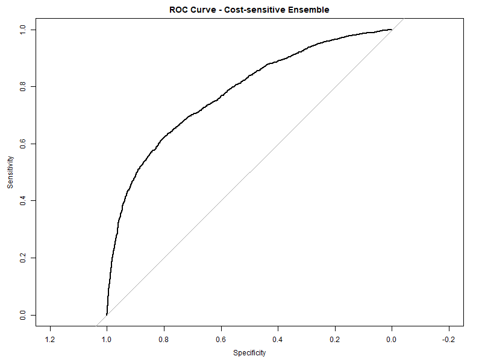

# 信用卡违约预测 | Credit Card Default Prediction

---

<p align="center">
  
  &nbsp;
  
</p>

<p align="center">
  
  &nbsp;
  
  &nbsp;
  
</p>

<p align="center">
  
  &nbsp;
  
</p>

---

## 中文

### 项目简介

本项目基于台湾 UCI 信用卡违约数据集，构建并比较五种机器学习模型，用于预测信用卡客户下一个月是否发生违约。项目涵盖完整的数据探索（EDA）、缺失值处理、特征工程、多模型训练与评估，以及基于代价敏感的集成决策方法。

> 本项目为 **MISY262（商业信息系统）第 2 组** 课程项目。

---

### 数据集

| 属性 | 说明 |
|------|------|
| 来源 | [UCI Machine Learning Repository](https://archive.ics.uci.edu/ml/datasets/default+of+credit+card+clients) |
| 文件 | `UCI_Credit_Card.csv` |
| 样本数 | 30,000 条客户记录 |
| 特征数 | 23 个（人口统计 + 历史还款 + 账单金额） |
| 目标变量 | `default.payment.next.month`（0 = 不违约，1 = 违约） |
| 类别分布 | 约 22% 违约，78% 不违约 |

---

### 方法论

本项目实现了以下五种模型：

| 模型 | 说明 |
|------|------|
| **逻辑回归 (Logistic Regression)** | 基线模型，可解释性强 |
| **决策树 (Decision Tree)** | `rpart` 包，直观可视化 |
| **随机森林 (Random Forest)** | 300 棵树，`mtry = 6`，集成方法 |
| **XGBoost** | 梯度提升，`max_depth = 4`，`eta = 0.1` |
| **代价敏感集成 (Cost-sensitive Ensemble)** | 三模型概率平均 + 阈值网格搜索（FN 代价 = 10，FP 代价 = 1） |

评估指标：混淆矩阵、准确率、AUC（ROC 曲线下面积）、期望总代价。

---

### 文件结构

```
Credit-Card-Default-Prediction/
├── MISY262_code.Rmd                          # 主分析代码（RMarkdown）
├── MISY262-code.html                         # 渲染后的 HTML 报告
├── UCI_Credit_Card.csv                       # 数据集
├── MISY262_final_paper.pdf                   # 最终论文
├── MISY262_presentation_slides.pdf           # 演示幻灯片
├── Group Project.pdf                         # 项目说明文档
├── Group2_Credit_Default_Presentation_Script.docx  # 演讲稿
├── Group Project Presentation Schedule.xlsx # 演示时间安排
├── CSWIM Template.docx                       # 报告模板
├── roc_logit.png                             # 逻辑回归 ROC 曲线
├── roc_tree.png                              # 决策树 ROC 曲线
├── roc_rf.png                                # 随机森林 ROC 曲线
├── roc_xgb.png                               # XGBoost ROC 曲线
├── roc_ens.png                               # 集成模型 ROC 曲线
├── .gitignore
├── LICENSE
└── README.md
```

---

### 运行方式

**环境要求：** R 4.x 或更高版本 + RStudio（推荐）

1. 克隆仓库：
   ```bash
   git clone https://github.com/ericxuzhesheng/Credit-Card-Default-Prediction.git
   cd Credit-Card-Default-Prediction
   ```

2. 安装所需 R 包：
   ```r
   install.packages(c("dplyr", "ggplot2", "caret", "pROC",
                       "rpart", "randomForest", "xgboost",
                       "naniar", "mice"))
   ```

3. 在 RStudio 中打开 `MISY262_code.Rmd`，点击 **Knit** 运行全部代码并生成 HTML 报告。

> 确保 `UCI_Credit_Card.csv` 与 `.Rmd` 文件在同一目录下，或修改代码中的路径。

---

### ROC 曲线结果

| 逻辑回归 | 决策树 |
|:---:|:---:|
|  |  |

| 随机森林 | XGBoost |
|:---:|:---:|
|  |  |

<p align="center">
  <strong>代价敏感集成</strong><br/>
  
</p>

---

## English

### Project Overview

This project builds and compares five machine learning models for predicting next-month credit card default using the UCI Taiwan credit card dataset. It covers full EDA, missing-value handling, feature engineering, multi-model training and evaluation, and a cost-sensitive ensemble decision approach.

> This is the **MISY262 (Business Information Systems) Group 2** course project.

---

### Dataset

| Attribute | Detail |
|-----------|--------|
| Source | [UCI Machine Learning Repository](https://archive.ics.uci.edu/ml/datasets/default+of+credit+card+clients) |
| File | `UCI_Credit_Card.csv` |
| Samples | 30,000 client records |
| Features | 23 (demographics + repayment history + bill amounts) |
| Target | `default.payment.next.month` (0 = no default, 1 = default) |
| Class balance | ~22% default, ~78% non-default |

---

### Methodology

Five models are implemented and compared:

| Model | Description |
|-------|-------------|
| **Logistic Regression** | Baseline, highly interpretable |
| **Decision Tree** | `rpart` package, visual rule extraction |
| **Random Forest** | 300 trees, `mtry = 6`, ensemble bagging |
| **XGBoost** | Gradient boosting, `max_depth = 4`, `eta = 0.1` |
| **Cost-sensitive Ensemble** | Average probabilities of 3 models + grid-search optimal threshold (FN cost = 10, FP cost = 1) |

Evaluation metrics: confusion matrix, accuracy, AUC (area under ROC curve), and expected total misclassification cost.

---

### Repository Structure

```
Credit-Card-Default-Prediction/
├── MISY262_code.Rmd                          # Main analysis code (RMarkdown)
├── MISY262-code.html                         # Rendered HTML report
├── UCI_Credit_Card.csv                       # Dataset
├── MISY262_final_paper.pdf                   # Final written report
├── MISY262_presentation_slides.pdf           # Presentation slides
├── Group Project.pdf                         # Project assignment sheet
├── Group2_Credit_Default_Presentation_Script.docx  # Presentation script
├── Group Project Presentation Schedule.xlsx # Presentation schedule
├── CSWIM Template.docx                       # Report template
├── roc_logit.png                             # ROC – Logistic Regression
├── roc_tree.png                              # ROC – Decision Tree
├── roc_rf.png                                # ROC – Random Forest
├── roc_xgb.png                               # ROC – XGBoost
├── roc_ens.png                               # ROC – Cost-sensitive Ensemble
├── .gitignore
├── LICENSE
└── README.md
```

---

### How to Run

**Requirements:** R 4.x or higher + RStudio (recommended)

1. Clone the repository:
   ```bash
   git clone https://github.com/ericxuzhesheng/Credit-Card-Default-Prediction.git
   cd Credit-Card-Default-Prediction
   ```

2. Install required R packages:
   ```r
   install.packages(c("dplyr", "ggplot2", "caret", "pROC",
                       "rpart", "randomForest", "xgboost",
                       "naniar", "mice"))
   ```

3. Open `MISY262_code.Rmd` in RStudio and click **Knit** to run all code and generate the HTML report.

> Make sure `UCI_Credit_Card.csv` is in the same directory as the `.Rmd` file, or update the path in the code.

---

### ROC Curve Results

| Logistic Regression | Decision Tree |
|:---:|:---:|
|  |  |

| Random Forest | XGBoost |
|:---:|:---:|
|  |  |

<p align="center">
  <strong>Cost-sensitive Ensemble</strong><br/>
  
</p>

---

## License

This project is released under the [MIT License](LICENSE).
