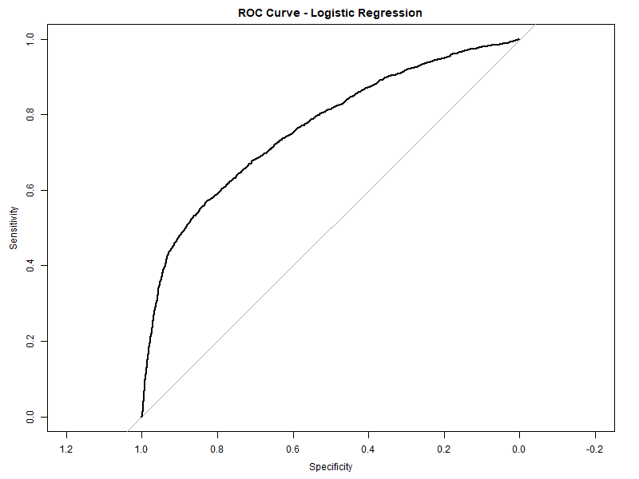
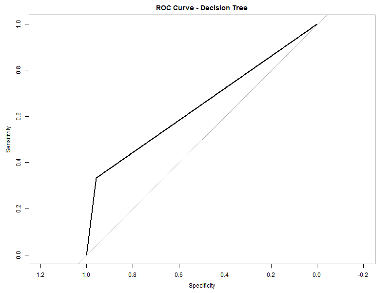
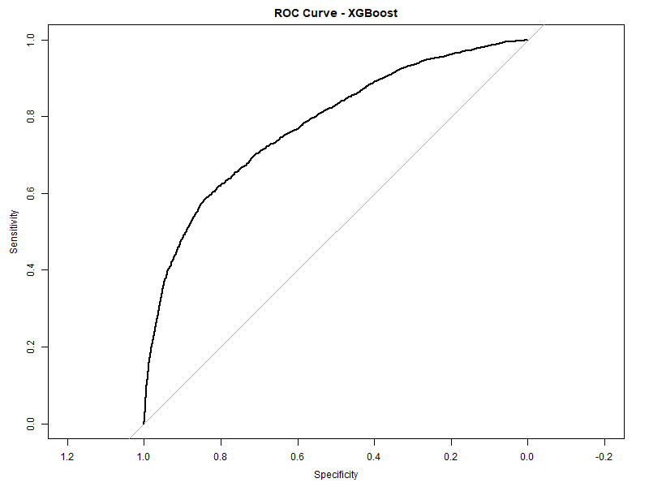

# 信用卡违约预测 | Credit Card Default Prediction

---

<p align="center">
  
  &nbsp;
  
</p>

<p align="center">
  
  &nbsp;
  
  &nbsp;
  
</p>

<p align="center">
  
  &nbsp;
  
</p>

---

## 中文

### 项目简介

本项目基于台湾 UCI 信用卡违约数据集，构建并比较五种机器学习模型，用于预测信用卡客户下一个月是否发生违约。项目涵盖完整的数据探索（EDA）、缺失值处理、特征工程、多模型训练与评估，以及基于代价敏感的集成决策方法。

> 本项目为 **MISY262（商业信息系统）第 2 组** 课程项目。

---

### 数据集

| 属性 | 说明 |
|------|------|
| 来源 | [UCI Machine Learning Repository](https://archive.ics.uci.edu/ml/datasets/default+of+credit+card+clients) |
| 文件 | `UCI_Credit_Card.csv` |
| 样本数 | 30,000 条客户记录 |
| 特征数 | 23 个（人口统计 + 历史还款 + 账单金额） |
| 目标变量 | `default.payment.next.month`（0 = 不违约，1 = 违约） |
| 类别分布 | 约 22% 违约，78% 不违约 |

---

### 方法论

本项目实现了以下五种模型：

| 模型 | 说明 |
|------|------|
| **逻辑回归 (Logistic Regression)** | 基线模型，可解释性强 |
| **决策树 (Decision Tree)** | `rpart` 包，直观可视化 |
| **随机森林 (Random Forest)** | 300 棵树，`mtry = 6`，集成方法 |
| **XGBoost** | 梯度提升，`max_depth = 4`，`eta = 0.1` |
| **代价敏感集成 (Cost-sensitive Ensemble)** | 三模型概率平均 + 阈值网格搜索（FN 代价 = 10，FP 代价 = 1） |

评估指标：混淆矩阵、准确率、AUC（ROC 曲线下面积）、期望总代价。

---

### 文件结构

```
Credit-Card-Default-Prediction/
├── code/
│   ├── MISY262_code.Rmd          # 主分析代码（RMarkdown）
│   └── MISY262-code.html         # 渲染后的 HTML 报告
├── data/
│   └── UCI_Credit_Card.csv       # 数据集（30,000 条记录）
├── figures/
│   ├── roc_logit.png             # 逻辑回归 ROC 曲线
│   ├── roc_tree.png              # 决策树 ROC 曲线
│   ├── roc_rf.png                # 随机森林 ROC 曲线
│   ├── roc_xgb.png               # XGBoost ROC 曲线
│   └── roc_ens.png               # 集成模型 ROC 曲线
├── docs/
│   ├── MISY262_final_paper.pdf              # 最终论文
│   ├── MISY262_presentation_slides.pdf      # 演示幻灯片
│   ├── Group Project.pdf                    # 项目说明文档
│   ├── Group2_Credit_Default_Presentation_Script.docx  # 演讲稿
│   ├── Group Project Presentation Schedule.xlsx        # 演示时间安排
│   └── CSWIM Template.docx                 # 报告模板
├── .gitignore
├── LICENSE
└── README.md
```

---

### 运行方式

**环境要求：** R 4.x 或更高版本 + RStudio（推荐）

1. 克隆仓库：
   ```bash
   git clone https://github.com/ericxuzhesheng/Credit-Card-Default-Prediction.git
   cd Credit-Card-Default-Prediction
   ```

2. 安装所需 R 包：
   ```r
   install.packages(c("dplyr", "ggplot2", "caret", "pROC",
                       "rpart", "randomForest", "xgboost",
                       "naniar", "mice"))
   ```

3. 在 RStudio 中打开 `code/MISY262_code.Rmd`，将第 47 行数据读取路径修改为 `"../data/UCI_Credit_Card.csv"`，点击 **Knit** 运行全部代码并生成 HTML 报告。

---

### 实验结果

#### 性能指标汇总

| 模型 | 准确率 | 灵敏度（召回率） | 特异度 | AUC | Kappa |
|------|:------:|:------:|:------:|:---:|:-----:|
| 逻辑回归 | 0.8202 | 0.3595 | 0.9509 | **0.7631** | 0.3728 |
| 决策树 | 0.8202 | 0.3327 | 0.9586 | 0.6456 | 0.3582 |
| 随机森林 | 0.8195 | 0.3851 | 0.9428 | 0.7604 | 0.3849 |
| XGBoost | 0.8195 | 0.3736 | 0.9461 | **0.7777** | 0.3788 |
| 代价敏感集成 | 0.4283 | **0.9397** | 0.2831 | 0.7780 | 0.1183 |

> 灵敏度 = 在所有真实违约者中，模型正确识别的比例（即"查全率"）；特异度 = 在所有真实不违约者中，模型正确识别的比例。

---

#### 结果解读

**① 逻辑回归（基线）**
准确率 82.0%，AUC = 0.763，Kappa = 0.373。作为基线模型表现稳健，正类精确率 67.5%，说明模型在预测为违约时有约 2/3 的把握是正确的，但灵敏度偏低（35.9%），即接近 2/3 的真实违约客户被漏判为"不违约"。

**② 决策树**
准确率与逻辑回归持平（82.0%），但 AUC 仅 0.646，明显低于其他模型，说明决策树对违约概率的排序能力较弱，ROC 曲线形态更为阶梯化。在可解释性上优势突出，适合业务规则提取，但预测精度受限。

**③ 随机森林**
AUC = 0.760，Kappa = 0.385（五模型中最高），综合性能最为均衡。灵敏度 38.5% 略高于其他传统模型，说明集成 bagging 能轻微改善对少数类（违约）的识别能力，但类别不平衡问题仍然存在。

**④ XGBoost**
AUC = 0.778，五模型中排名第一（与集成模型持平），准确率 82.0%，Kappa 0.379。梯度提升在本数据集上展现出最强的概率排序能力，是单一模型中综合表现最优的方案。

**⑤ 代价敏感集成（核心创新）**
将逻辑回归、随机森林、XGBoost 三模型的预测概率等权平均，通过网格搜索寻找最优决策阈值（误报代价 FP = 1，漏报代价 FN = 10），最终最优阈值为 **0.10**。

在该阈值下：
- 灵敏度跃升至 **93.97%**，即几乎所有真实违约客户都被识别出来
- 代价为特异度大幅下降至 28.3%，准确率降至 42.8%，大量不违约客户被误判为违约
- AUC = 0.778，与 XGBoost 持平，说明模型本身的排序能力并未提升，提升的是**风险偏好调整后的决策规则**

> **核心结论**：当漏报一个违约客户的业务损失约为误报一个正常客户的 10 倍时，将阈值从 0.5 压低至 0.1 可将违约识别率从 ~37% 提升至 ~94%，以牺牲整体准确率为代价显著降低期望总损失，在信用风险管理场景下具有实际意义。

---

### ROC 曲线

| 逻辑回归 | 决策树 |
|:---:|:---:|
|  |  |

| 随机森林 | XGBoost |
|:---:|:---:|
|  |  |

<p align="center">
  <strong>代价敏感集成</strong><br/>
  
</p>

---

## English

### Project Overview

This project builds and compares five machine learning models for predicting next-month credit card default using the UCI Taiwan credit card dataset. It covers full EDA, missing-value handling, feature engineering, multi-model training and evaluation, and a cost-sensitive ensemble decision approach.

> This is the **MISY262 (Business Information Systems) Group 2** course project.

---

### Dataset

| Attribute | Detail |
|-----------|--------|
| Source | [UCI Machine Learning Repository](https://archive.ics.uci.edu/ml/datasets/default+of+credit+card+clients) |
| File | `UCI_Credit_Card.csv` |
| Samples | 30,000 client records |
| Features | 23 (demographics + repayment history + bill amounts) |
| Target | `default.payment.next.month` (0 = no default, 1 = default) |
| Class balance | ~22% default, ~78% non-default |

---

### Methodology

Five models are implemented and compared:

| Model | Description |
|-------|-------------|
| **Logistic Regression** | Baseline, highly interpretable |
| **Decision Tree** | `rpart` package, visual rule extraction |
| **Random Forest** | 300 trees, `mtry = 6`, ensemble bagging |
| **XGBoost** | Gradient boosting, `max_depth = 4`, `eta = 0.1` |
| **Cost-sensitive Ensemble** | Average probabilities of 3 models + grid-search optimal threshold (FN cost = 10, FP cost = 1) |

Evaluation metrics: confusion matrix, accuracy, AUC (area under ROC curve), and expected total misclassification cost.

---

### Repository Structure

```
Credit-Card-Default-Prediction/
├── code/
│   ├── MISY262_code.Rmd          # Main analysis code (RMarkdown)
│   └── MISY262-code.html         # Rendered HTML report
├── data/
│   └── UCI_Credit_Card.csv       # Dataset (30,000 records)
├── figures/
│   ├── roc_logit.png             # ROC – Logistic Regression
│   ├── roc_tree.png              # ROC – Decision Tree
│   ├── roc_rf.png                # ROC – Random Forest
│   ├── roc_xgb.png               # ROC – XGBoost
│   └── roc_ens.png               # ROC – Cost-sensitive Ensemble
├── docs/
│   ├── MISY262_final_paper.pdf              # Final written report
│   ├── MISY262_presentation_slides.pdf      # Presentation slides
│   ├── Group Project.pdf                    # Project assignment sheet
│   ├── Group2_Credit_Default_Presentation_Script.docx  # Presentation script
│   ├── Group Project Presentation Schedule.xlsx        # Presentation schedule
│   └── CSWIM Template.docx                 # Report template
├── .gitignore
├── LICENSE
└── README.md
```

---

### How to Run

**Requirements:** R 4.x or higher + RStudio (recommended)

1. Clone the repository:
   ```bash
   git clone https://github.com/ericxuzhesheng/Credit-Card-Default-Prediction.git
   cd Credit-Card-Default-Prediction
   ```

2. Install required R packages:
   ```r
   install.packages(c("dplyr", "ggplot2", "caret", "pROC",
                       "rpart", "randomForest", "xgboost",
                       "naniar", "mice"))
   ```

3. Open `code/MISY262_code.Rmd` in RStudio, update the data path on line 47 to `"../data/UCI_Credit_Card.csv"`, then click **Knit** to run all code and generate the HTML report.

---

### ROC Curve Results

| Logistic Regression | Decision Tree |
|:---:|:---:|
|  |  |

| Random Forest | XGBoost |
|:---:|:---:|
|  |  |

<p align="center">
  <strong>Cost-sensitive Ensemble</strong><br/>
  
</p>

---

## License

This project is released under the [MIT License](LICENSE).
